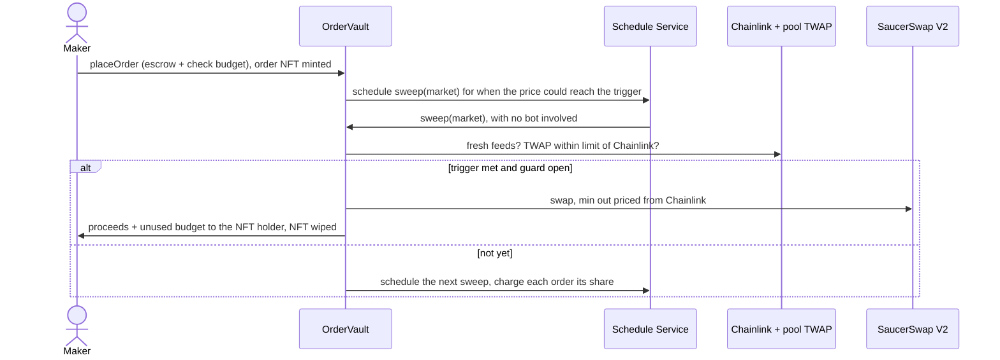

# saucerswap-limit-orders

Limit and stop orders for SaucerSwap V2 on Hedera, with no keeper bot. A [Scaffold-HBAR](https://docs.hedera.com/solutions/tools/scaffold-hbar) template: Foundry contracts and a Next.js frontend for Hedera testnet.

You escrow tokens in `OrderVault` together with a small HBAR budget. The vault mints you an HTS NFT that *is* the order, and asks the Hedera Schedule Service to call it back. From then on the network itself runs a sweep over each market. Each sweep waits as long as the price needs to reach the nearest trigger, and fills orders whose trigger is met, but only while a guard confirms the pool's TWAP agrees with Chainlink. Nothing off-chain has to stay online.



| Hedera service | What it does here |
| --- | --- |
| Schedule Service, `0x16b` (HIP-1215) | The vault schedules each market's next sweep itself and pays for it from order budgets. No bot, no cron. |
| Token Service, `0x167` | Each order is an NFT in a collection the vault controls. Whoever holds the NFT can cancel and receives the fill; the vault wipes it at settlement. |
| Exchange rate, `0x168` | Converts gas priced in USD cents to tinybar, so budgets follow the live HBAR rate. |
| Mirror node | The frontend reads order history, NFT holdings and associations from it; no indexer to run. |

## See it work on testnet

The vault is [0.0.10787941](https://hashscan.io/testnet/contract/0.0.10787941) (`0x86867b8261f07b2be5427692417bb6b36e4e644a`) and its order NFTs are [0.0.10787943](https://hashscan.io/testnet/token/0.0.10787943). Every row below was executed on testnet and is checked on the mirror node by `node scripts/gate-check.mjs --proofs-only`. "Scheduled" means the transaction was run by the Schedule Service, not sent by anyone.

| What happened | Transaction |
| --- | --- |
| **Stop-loss filled by the Schedule Service.** Order #5 (sell 0.5 DAI at or below 1.0000) placed, then filled on the next scheduled sweep: 0.500878 USDC out against a 0.498475 minimum, Chainlink 0.99995, pool TWAP 1.00230 | placed [1790748364.097643765](https://hashscan.io/testnet/transaction/1790748364.097643765), filled (scheduled) [1790748622.032910088](https://hashscan.io/testnet/transaction/1790748622.032910088) |
| **Guard refuses a manipulated-looking pool.** Order #3's trigger was met, but the HBAR/USDC pool TWAP (2.0179) was 18× Chainlink (0.1044), so the fill was held; the retry backed off from 10 to 20 min | held (scheduled) [1790748334.031783104](https://hashscan.io/testnet/transaction/1790748334.031783104) and [1790748932.117943104](https://hashscan.io/testnet/transaction/1790748932.117943104) |
| **Orders share a sweep.** One scheduled sweep charged orders #1 and #2 0.9849 HBAR each instead of 1.8977 alone; a later one split it three ways while filling #5 | (scheduled) [1790748324.077601104](https://hashscan.io/testnet/transaction/1790748324.077601104) |
| **Cancel by the NFT holder.** Order #3 cancelled; 1 HBAR and 8.3537 HBAR of budget refunded, 0.1141 HBAR kept to pay for the pending sweep it left behind | [1790748978.071959657](https://hashscan.io/testnet/transaction/1790748978.071959657) |
| **The order follows its NFT.** Order #4's NFT was transferred to another account, the original owner's cancel reverts with `NotHolder`, and the new holder cancels and receives the refund | transfer [1790748105.334112819](https://hashscan.io/testnet/transaction/1790748105.334112819), cancel by the new holder [1790748137.174472309](https://hashscan.io/testnet/transaction/1790748137.174472309) |

The frontend ships pointed at this vault, so `yarn next:dev` works without deploying anything.

## Create a project

```bash
npm create scaffold-hbar@latest my-app -- --template Jagadeeshftw/saucerswap-limit-orders
```

Keep the `--`: without it npm swallows `--template`. The CLI asks for a package manager; pass `--package-manager yarn` or `--package-manager npm` to skip the prompt. Every command below uses yarn; with npm, use `npm run <script>`.

Prerequisites: Node.js 20.18.3 or later, Git with `user.name` and `user.email` set (the CLI makes the first commit), Yarn (`corepack enable`) or npm, and Foundry 1.4 or later for contracts and tests.

## Run it

```bash
yarn next:dev            # http://localhost:3000, against the live testnet vault
```

Connect a wallet on Hedera testnet (chain 296) funded from the [portal faucet](https://portal.hedera.com/faucet). The Trade page walks you through associating the order NFT collection and the output token, approving the input token, and placing the order.

### Deploy your own vault

```bash
yarn foundry:account:import      # or foundry:account:generate, then fund it from the faucet
yarn foundry:deploy              # Hedera testnet; about 25 HBAR, mostly the HTS collection fee
```

This deploys `OrderVault` and its two libraries, creates the NFT collection, lists both markets and rewrites `packages/nextjs/contracts/deployedContracts.ts`. There is no local chain: Anvil has none of Hedera's system contracts, so the vault only runs on Hedera. Tests use mocks of them instead.

### Configuration

| Variable | File | Default | Used for |
| --- | --- | --- | --- |
| `NEXT_PUBLIC_HEDERA_TESTNET_RPC_URL` | `packages/nextjs/.env.local` | `https://testnet.hashio.io/api` | Wallet reads and transactions |
| `NEXT_PUBLIC_MIRROR_NODE_URL` | `packages/nextjs/.env.local` | `https://testnet.mirrornode.hedera.com` | Order history, NFTs, associations, lag |
| `NEXT_PUBLIC_WALLET_CONNECT_PROJECT_ID` | `packages/nextjs/.env.local` | scaffold's shared id | WalletConnect; get your own for production |
| `HEDERA_RPC_URL` | `packages/foundry/.env` | `https://testnet.hashio.io/api` | Fork tests and `yarn foundry:pool-gap` |
| `FORK_TESTS` | shell | unset | `true` runs the guard fork tests against live testnet |

Deploys sign with a Foundry keystore, so no private key goes in any file.

## What an order costs

Hedera charges a fixed fee to schedule a contract call: about $0.12 (`ScheduleCreate` with a `ContractCall`, $0.0099 + $0.09, plus the 20% system-contract surcharge). That is 89% of a check, whatever the gas limit or delay. So the vault saves money the only way it can, by running fewer sweeps: each one waits about as long as the price needs to reach the nearest trigger.

| Market | Checks at most every | at least every | assumed fastest move |
| --- | --- | --- | --- |
| HBAR / USDC | 5 min | 6 h | 2.5% an hour |
| DAI / USDC | 5 min | 6 h | 0.25% an hour |

| Cost, read from the vault (testnet rate, 1 HBAR = 7.7 ¢) | HBAR |
| --- | --- |
| One check, the only order in its market | 1.8977 |
| One check shared by 2 / 5 / 20 orders | 0.9849 / 0.4372 / 0.1634 |
| Reserve every order keeps for its fill and last check (HBAR sell / token sell) | 0.8768 / 1.2371 |
| Minimum budget | 12.2633 / 12.6236 |

A market with a single order costs 7.6 to 22.8 HBAR a day depending on how far the trigger is, instead of 546 HBAR a day when it checked every 5 minutes. The Trade page sizes the budget to cover the order until it expires and shows the price of each expiry. Orders in the same market split the fixed part. Unused budget is refunded. The full model, with the measured gas per segment, is in [docs/ARCHITECTURE.md](docs/ARCHITECTURE.md#what-it-costs).

The trade-off: a price that moves faster than the assumed rate is noticed late. The fill is still priced from Chainlink at the moment it happens and still guarded, and anyone can call `executeOrder(id)` or `sweep(market, 0)` to check sooner at their own gas cost.

## The guard, and why HBAR/USDC never fills on testnet

A fill needs both Chainlink feeds to be fresh (`maxOracleAge`) and the pool's TWAP over `twapWindow` to sit within `maxDeviationBps` of the Chainlink price. The trigger is read from Chainlink, and the minimum output is Chainlink's price less your slippage. Someone who pushes the pool around can't trigger your order or fill it at a bad price; the order waits.

The only HBAR/USDC pool on testnet ([0.0.9283328](https://hashscan.io/testnet/contract/0.0.9283328)) prices HBAR at about 2.02 USDC while Chainlink says 0.104, so its guard stays closed and HBAR orders are held, which is the guard doing its job. Aligning that pool would take selling about **51,500 HBAR** into it (the exact figure moves with Chainlink; `yarn foundry:pool-gap` prints today's), and creating a new pool costs SaucerSwap's `poolCreateFee` of 1e16 tinycents (**$1,000,000, about 12,975,835 testnet HBAR**). No testnet HBAR pool sits within 2% of Chainlink. The DAI/USDC pool does (23 bps), so DAI orders fill: a working stablecoin stop-loss. Both markets run the same code, and on an arbitraged network HBAR/USDC fills too.

To see how far a pool is from Chainlink and what it would take to bring it back:

```bash
yarn foundry:pool-gap             # HBAR/USDC
MARKET=2 yarn foundry:pool-gap    # DAI/USDC
```

It reads the pool's tick, liquidity and initialized ticks plus both feeds on a fork, and prints the token and amount to sell into the pool. Swapping that amount through the SaucerSwap router re-aligns it. It moves the price for everyone and anyone can push it back, which is why the guard exists.

## When checks stop

If a market has funded orders but no check is scheduled, the Trade page and the order page show **Checks stopped** with a **Restart checks** button, and `sweepStatus(market)` returns `Stalled`. Anyone can call `restartSweep(market)`; they pay only the scheduling fee. It can happen when:

- The vault can't pay for a scheduled call. Hedera reserves `gas limit × gas price` from the vault when the sweep runs, and a failed payment is dropped without an event. The vault always holds every order's budget, so keep a few HBAR of surplus in it (don't withdraw it all).
- HSS rejects a schedule (`SweepScheduleFailed`), for example when a second is already full.

Topping up an order also restarts a stopped market.

## What to change first

- **Add a market:** add a function to `script/MarketConfig.sol` like `usdcDai()` (both tokens need Chainlink feeds), call `listMarket` from `Deploy.s.sol`, and redeploy. The frontend lists every market the vault has.
- **Tune how often checks run:** `SweepParams` (`minInterval`, `maxInterval`, `maxMoveBpsPerHour`). Lower `maxMoveBpsPerHour` costs less and reacts later. Change a live market with `updateMarket`.
- **Tune the guard:** `GuardParams`. `MarketGuard.paramsValid` keeps it meaningful: TWAP 5 min to 1 day, oracle age 60 s to 26 h, deviation and slippage at most 10%.
- **Recalibrate costs:** measure a few scheduled sweeps on the mirror node (`gas_used` in `/api/v1/contracts/{id}/results/{timestamp}`) and call `setCosts`. The frontend reads costs from the vault, so nothing else changes.
- **Mainnet:** add mainnet addresses to `MarketConfig.sol`, allow chain 295 in `Deploy.s.sol` (it deploys to testnet only), add the network to `scaffold.config.ts`, and tighten `maxOracleAge` to the mainnet feeds' heartbeat.

## Tests

```bash
yarn foundry:test          # unit, fuzz, edge and invariant suites (mocked Hedera system contracts)
yarn foundry:test:fork     # the guard against the real testnet pools and feeds
yarn next:test             # frontend units: amounts, prices, budgets, order trail
yarn next:test:e2e         # Playwright at 1440 and 390, every UI state
```

| Suite | Tests |
| --- | --- |
| Unit (`OrderVault.t.sol`, `OrderVault.edges.t.sol`, `PriceMath.t.sol`, handler checks) | 103 |
| Fuzz (vault and price maths, 256 runs each) | 12 |
| Invariant (escrow, solvency, credits, bookkeeping, NFTs, liveness; 256 runs × 500 calls) | 6 |
| Fork (live testnet) | 3 |
| Frontend unit / e2e | 34 / 59 (30 specs at two widths; the burger-menu spec only runs at 390), plus one live-testnet spec |

Coverage of `OrderVault.sol`: 99.4% of lines, 96.1% of branches, 100% of functions; the libraries are at 100%. The e2e suite runs a production build against a mocked relay, mirror node and injected wallet, so it is deterministic and never signs anything.

## Troubleshooting

| You see | What to do |
| --- | --- |
| "Associate the order NFT collection" | Your account has no free auto-association slot. Press Associate (HIP-719), then place the order. |
| A fill credited instead of paid | You weren't associated with the output token when it filled. Associate it, then `claim(token)`. |
| Budget empty | The order only has its reserve left. Top it up on the order page; checks resume. |
| Held by guard | The pool is too far from Chainlink or a feed is stale. The order waits and retries with back-off. See `yarn foundry:pool-gap`. |
| Checks stopped | Press Restart checks (anyone can), or top up an order. |
| "Status may be up to N s behind" | The mirror node trails consensus. Order state from the contract is current; the trail catches up. |
| HBAR amounts off by 10^10 in your own code | Wallets send HBAR as 18-decimal weibar in `value`; the contracts count 8-decimal tinybar. Convert only through `utils/orders/units.ts`. |
| Your own call to the vault reverts with no reason, using all its gas | The relay's `eth_estimateGas` undercounts Token Service and Schedule Service work (a placement estimated at 551,766 gas needs up to 2.8M). Pass an explicit limit; `utils/orders/gas.ts` has measured ones. Hedera bills only the gas used. |
| Deploy fails with insufficient funds | Fund the deployer with at least 25 testnet HBAR; the NFT collection alone costs about 15. |

## Layout

```
packages/foundry/
  contracts/OrderVault.sol                orders, sweeps, fills, settlement, cost views
  contracts/libraries/MarketGuard.sol     Chainlink vs TWAP guard and its parameter bounds
  contracts/libraries/OrderCollection.sol creates the order NFT collection
  contracts/libraries/PriceMath.sol       tick maths, cross prices, bps
  script/MarketConfig.sol                 testnet addresses, markets, measured costs
  script/Deploy.s.sol, script/PoolGap.s.sol
  test/                                   unit, fuzz, edge, invariant, fork
packages/nextjs/
  app/                                    Trade (/), My orders (/orders), order detail (/orders/[id])
  components/orders/                      ticket, market panel, guard and checks-stopped banners
  hooks/orders/                           vault reads, mirror-node queries, wallet setup, tx state
  utils/orders/                           units, budgets, statuses, order trail, error messages
  e2e/                                    Playwright specs and network mocks
docs/ARCHITECTURE.md                      design, cost model, threat model, invariants
```

## Template gate check

`scripts/gate-check.mjs` reproduces the bounty's eligibility gate with the real `create-scaffold-hbar` CLI. It scaffolds with npm and with yarn, then runs install, lint, type-check, build, the contract tests, a production and a dev boot with route checks, gitleaks, licence and manifest checks, and verifies every testnet proof above on the mirror node.

```bash
node scripts/gate-check.mjs                 # scaffold from GitHub, as a stranger would
node scripts/gate-check.mjs --local         # scaffold from the working tree
node scripts/gate-check.mjs --proofs-only   # just the testnet proofs
```

## Licence

MIT. See [LICENSE](LICENSE).
