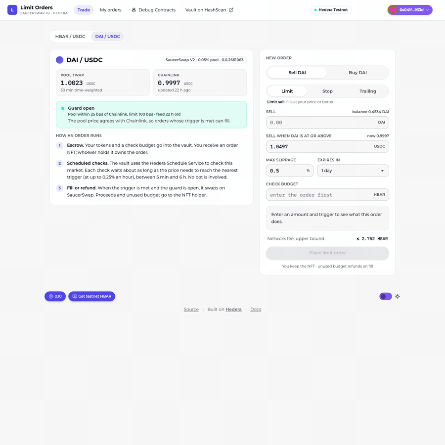
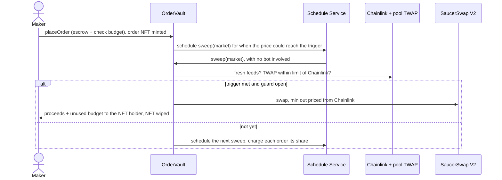

# saucerswap-limit-orders

[](https://limit-orders.0xo.in)

**Documentation: [limit-orders.0xo.in](https://limit-orders.0xo.in)** (mirror: [saucerswap-limit-orders-docs.vercel.app](https://saucerswap-limit-orders-docs.vercel.app)).

Limit and stop orders for SaucerSwap V2 on Hedera, with no keeper bot. A [Scaffold-HBAR](https://docs.hedera.com/solutions/tools/scaffold-hbar) template: Foundry contracts and a Next.js frontend for Hedera testnet.



*Live on testnet: a 0.1 DAI stop-loss placed in the browser, filled by the Schedule Service with no bot, and its trail on the order page — every step links to [HashScan](https://hashscan.io/testnet/contract/0.0.10809822).*

You escrow tokens in `OrderVault` together with a small HBAR budget. The vault mints you an HTS NFT that *is* the order, and asks the Hedera Schedule Service to call it back. From then on the network itself runs a sweep over each market. Each sweep waits as long as the price needs to reach the nearest trigger, and fills orders whose trigger is met, but only while a guard confirms the pool's TWAP agrees with Chainlink. Nothing off-chain has to stay online.



| Hedera service | What it does here |
| --- | --- |
| Schedule Service, `0x16b` (HIP-1215) | The vault schedules each market's next sweep itself and pays for it from order budgets. No bot, no cron. |
| Token Service, `0x167` | Each order is an NFT in a collection the vault controls. Whoever holds the NFT can cancel and receives the fill; the vault wipes it at settlement. |
| Exchange rate, `0x168` | Converts gas priced in USD cents to tinybar, so budgets follow the live HBAR rate. |
| Mirror node | The frontend reads order history, NFT holdings and associations from it; no indexer to run. |

## See it work on testnet

The vault is [0.0.10809822](https://hashscan.io/testnet/contract/0.0.10809822) (`0xc265045C65d0114109072d60b3A60231427a06a9`), its order NFTs are [0.0.10809825](https://hashscan.io/testnet/token/0.0.10809825), and the read-only lens is [0.0.10809847](https://hashscan.io/testnet/contract/0.0.10809847). The order types are limit [0.0.10809832](https://hashscan.io/testnet/contract/0.0.10809832), stop [0.0.10809835](https://hashscan.io/testnet/contract/0.0.10809835) and trailing stop [0.0.10809842](https://hashscan.io/testnet/contract/0.0.10809842). All of them, and the four libraries, are verified on Sourcify, so HashScan shows their source. Every row below was executed on testnet and is checked on the mirror node by `node scripts/gate-check.mjs --proofs-only`. "Scheduled" means the transaction was run by the Schedule Service, not sent by anyone.

| What happened | Transaction |
| --- | --- |
| **Stop-loss filled by the Schedule Service.** Order #2 (sell 0.1 DAI at or below 1.0000), placed by a script with its trigger already met, brought the market's next check forward; that scheduled sweep filled it: 0.100175 USDC out against a 0.099478 minimum, Chainlink 0.99979, pool TWAP 1.00230 | placed [1790870656.011161104](https://hashscan.io/testnet/transaction/1790870656.011161104), filled (scheduled) [1790870954.024028208](https://hashscan.io/testnet/transaction/1790870954.024028208) |
| **The same through the frontend.** Order #3 placed on the Trade page (Playwright driving the real UI and signing with a testnet key) and filled by the next scheduled sweep: 0.100175 USDC out against a 0.099478 minimum | placed [1790871019.550469104](https://hashscan.io/testnet/transaction/1790871019.550469104), filled (scheduled) [1790871319.125050208](https://hashscan.io/testnet/transaction/1790871319.125050208) |
| **A trailing stop, run by the Schedule Service.** Order #1 (0.1 DAI, 0.5% trail, `orderType` 2) placed from a testnet burner account; its first scheduled check set the peak (`OrderStateUpdated`), from which the trigger trails | placed [1790869442.280121132](https://hashscan.io/testnet/transaction/1790869442.280121132), peak set (scheduled) [1790870954.024028208](https://hashscan.io/testnet/transaction/1790870954.024028208) |
| **The peak ratchets up.** HBAR trailing stop #7 (1 HBAR, 0.5% trail): its first scheduled check set the peak at 0.10245, and a later one raised it to 0.10312 as HBAR rose, taking the trigger up to 0.10260 (later checks kept raising it, to 0.10423 by 23:30 IST on 2026-10-01). The trigger never moves down | peak raised (scheduled) [1790874527.080484104](https://hashscan.io/testnet/transaction/1790874527.080484104) |
| **Guard refuses a manipulated-looking pool.** Order #4's trigger was met, but the HBAR/USDC pool TWAP (2.0151) was ~19.6x Chainlink (0.10299), so the fill was held; the retry backed off from 5 to 10 min | held (scheduled) [1790871684.039916208](https://hashscan.io/testnet/transaction/1790871684.039916208) and [1790872282.009223208](https://hashscan.io/testnet/transaction/1790872282.009223208) |
| **Orders share a sweep.** The sweep that filled #2 also checked trailing stop #1: one run, two orders, each charged 0.7475 HBAR instead of a solo 1.4363 | (scheduled) [1790870954.024028208](https://hashscan.io/testnet/transaction/1790870954.024028208) |
| **Cancel by the NFT holder.** Order #4 cancelled by its holder; 1 HBAR of escrow and 7.04 HBAR of unused budget refunded | [1790872335.349111575](https://hashscan.io/testnet/transaction/1790872335.349111575) |
| **The order follows its NFT.** Order #5's NFT was transferred to another account; the original owner's cancel would revert with `NotHolder`, and the new holder cancelled and received the 1 HBAR escrow and its 10 HBAR budget | transfer [1790871419.739922428](https://hashscan.io/testnet/transaction/1790871419.739922428), cancel by the new holder [1790871432.524922728](https://hashscan.io/testnet/transaction/1790871432.524922728) |
| **Keeperless recovery when the network is congested.** A third party reserved every second of the Schedule Service's per-second gas capacity in the 64-second window the vault probes, so the sweep could not rebook (`SweepScheduleFailed`, response 370 `SCHEDULE_EXPIRY_IS_BUSY`) and the market stalled; a third account's permissionless `restartSweep` resumed the chain | stalled (scheduled) [1790874158.019936208](https://hashscan.io/testnet/transaction/1790874158.019936208), restarted by a third account [1790874210.109869176](https://hashscan.io/testnet/transaction/1790874210.109869176) |

The frontend ships pointed at this vault, so `yarn next:dev` works without deploying anything. It runs the exact contracts in this repo, and a payer float keeps its scheduled calls funded; a [residual stall](docs/ARCHITECTURE.md#known-limits) like the one above is recoverable by anyone with `restartSweep`.

**What testnet can't show, and where it is shown instead.**

- *An HBAR fill.* The only testnet HBAR/USDC pool trades far from Chainlink, so its guard holds every fill (above). On a fork of mainnet the same guard opens: `yarn foundry:fork-guard` read Chainlink 0.10271 against a pool TWAP of 0.10265 on 2026-10-01, 4 bps apart.
- *A trailing stop's fill.* The testnet DAI and USDC feeds update about once a day, and the DAI/USDC cross moved less than 0.05% over the last month, while the smallest trail is 0.5%; the HBAR market's guard holds every fill; and HTS tokens can't be swapped on a fork. So testnet shows a trailing stop's placement and the Schedule Service's checks setting and raising its peak. The fill itself is covered by `test_trailingStop_ridesUpThenFillsOnPullback`, the fuzz test `testFuzz_trailingStop_triggerNeverFallsAndFiresBelowPeak` and the differential campaign against v1.0.1.

## Create a project

```bash
# npm — note the `--` before the flags, or npm keeps them and the template flag is dropped
npm create scaffold-hbar@latest my-app -- --template Jagadeeshftw/saucerswap-limit-orders

# npx — no separator needed
npx create-scaffold-hbar@latest my-app --template Jagadeeshftw/saucerswap-limit-orders

# yarn
yarn create scaffold-hbar my-app --template Jagadeeshftw/saucerswap-limit-orders
```

With `npm create`, everything after `my-app` must follow a `--` separator, or npm swallows `--template` and you
get the blank template instead of this one. The `npx` and `yarn create` forms pass the flag straight through.

The CLI asks four questions: whether to install the Hedera Skills for AI coding agents, the network (pick testnet), the package manager, and whether to install dependencies. To answer them up front, for a script, CI or an agent without a terminal, add `--network testnet --yes` and `--package-manager` with your choice. `--yes` alone takes the template's default package manager and installs the Skills; add `--skip-hedera-skills` to leave them out.

Prerequisites:

- Node.js 20.18.3 or later.
- Git with `user.name` and `user.email` set; the CLI makes the first commit.
- For the Corepack-managed package manager, run `corepack enable` once (Node 25 and later no longer bundle Corepack: `npm install -g corepack`).
- Foundry 1.5 and `make`, for the contracts, tests and deploy scripts. CI pins 1.5.0; `foundryup --install 1.5.0` installs it. Foundry 1.8 builds everything and passes every test except the differential campaign's gas bound, which its fuzzer measures differently.
- Chromium for the browser tests, once: `cd packages/nextjs && npx playwright install chromium`.

Commands below use the project's package manager; on GitHub they are shown for the template's default, and a project created with the other one gets them rewritten by the CLI. Put flags for a script after `--`, which works with both: `yarn foundry:deploy -- --keystore my-key`.

## Run it

```bash
yarn next:dev            # http://localhost:3000, against the live testnet vault
```

Connect a wallet on Hedera testnet (chain 296) funded from the [portal faucet](https://portal.hedera.com/faucet). The Trade page walks you through associating the order NFT collection and the output token, approving the input token, and placing the order.

## Get a Hedera testnet account

New to Hedera? You need one testnet account with some HBAR, and an EVM (ECDSA) key.

1. Open the [Hedera Portal](https://portal.hedera.com/), sign in, and create a **testnet** account. It is funded
   with test HBAR and refills daily from the [faucet](https://portal.hedera.com/faucet).
2. Choose an **ECDSA (secp256k1)** key, not ED25519. This template is EVM-native: the JSON-RPC relay, your
   browser wallet and the deploy scripts all sign with an ECDSA key, and the portal shows its matching
   `0x` EVM address. (ED25519 accounts work on Hedera generally but not through the EVM tooling here.)
3. Every account has two names for the same thing: a Hedera id like `0.0.12345` and a 20-byte EVM address like
   `0x…`. The mirror node maps between them; the UI and HashScan show both.
4. Put the private key only in a gitignored `.env.local` (frontend) or import it into the Foundry keystore
   (below) — never commit it.

## Deploy your own vault

```bash
yarn foundry:account:import      # or foundry:account:generate, then fund it from the faucet
yarn foundry:deploy              # Hedera testnet; about 25 HBAR, mostly the HTS collection fee
```

This deploys `OrderVault` with its four libraries (`MarketGuard`, `MarketRegistry`, `OrderCollection`, `Settlement`), creates the NFT collection, lists both markets, deploys and registers the three order types (limit 0, stop 1, trailing stop 2), deploys `OrderVaultLens`, and rewrites `packages/nextjs/contracts/deployedContracts.ts`. There is no local chain: Anvil has none of Hedera's system contracts, so the vault only runs on Hedera, and the tests use mocks of them instead. The scaffold's `foundry:chain` and `--network localhost` still exist from the base template but don't apply here.

## Configuration

The defaults work out of the box. To override the frontend's, copy `packages/nextjs/.env.example` to `packages/nextjs/.env.local`; `packages/foundry/.env` is created from its `.env.example` when you install.

| Variable | File | Default | Used for |
| --- | --- | --- | --- |
| `NEXT_PUBLIC_HEDERA_TESTNET_RPC_URL` | `packages/nextjs/.env.local` | `https://testnet.hashio.io/api` | Wallet reads and transactions |
| `NEXT_PUBLIC_MIRROR_NODE_URL` | `packages/nextjs/.env.local` | `https://testnet.mirrornode.hedera.com` | Order history, NFTs, associations, lag |
| `NEXT_PUBLIC_WALLET_CONNECT_PROJECT_ID` | `packages/nextjs/.env.local`, or your host's environment | scaffold's shared id | WalletConnect QR for mobile wallets; set your own before you deploy (below) |
| `HEDERA_RPC_URL` | `packages/foundry/.env` | `https://testnet.hashio.io/api` | The `hedera_testnet` endpoint in `foundry.toml`: fork tests and `yarn foundry:pool-gap` |
| `FORK_TESTS` | shell | unset | `true` runs the guard fork tests against live testnet |

**WalletConnect project id.** Injected wallets (MetaMask, Rabby, HashPack in EVM mode) need no configuration. The
WalletConnect QR, for mobile wallets, uses a project id: without one the app falls back to the scaffold's shared
id, which is fine on `localhost` but is shared by every scaffold app and can be restricted to its owner's domains,
so the QR may fail on yours. Before you deploy:

1. Create a free project at [cloud.reown.com](https://cloud.reown.com) (WalletConnect Cloud) and copy its project id.
2. Add your site's domains to the project's allowed domains (for Vercel, the production domain and, if you use
   previews, the preview domain pattern).
3. Set `NEXT_PUBLIC_WALLET_CONNECT_PROJECT_ID`: in `packages/nextjs/.env.local` for local builds, or on Vercel under
   Project → Settings → Environment Variables (Production and Preview), then redeploy. `NEXT_PUBLIC_` values are
   built into the bundle, so a change needs a new build.

The id is public by design (it ships in the bundle), but keep it out of the repo, so forks of your app don't spend
your quota. This repo commits none; the demo at limit-orders-demo.0xo.in sets its own on Vercel.

Deploys sign with a Foundry keystore, so no private key goes in any file.

## What an order costs

Hedera charges a fixed fee to schedule a contract call: about 1.17 HBAR (≈ $0.12 on 2026-10-01; Hedera sets the `ScheduleCreate` and inner `ContractCall` fees in USD, plus a 20% system-contract surcharge, so the HBAR figure moves with the exchange rate). That is 81% of a check, whatever the gas limit or delay. So the vault saves money the only way it can, by running fewer sweeps: each one waits about as long as the price needs to reach the nearest trigger.

| Market | Checks at most every | at least every | assumed fastest move |
| --- | --- | --- | --- |
| HBAR / USDC | 5 min | 6 h | 2.5% an hour |
| DAI / USDC | 5 min | 6 h | 0.25% an hour |

| Cost, read from the lens (2026-10-01, 1 HBAR = 10.4 ¢) | HBAR |
| --- | --- |
| One check, the only order in its market | 1.4363 |
| One check shared by 2 / 5 / 20 orders | 0.7475 / 0.3342 / 0.1276 |
| Reserve every order keeps for its fill and last check (HBAR sell / token sell) | 0.6730 / 0.9440 |
| Minimum budget | 9.2905 / 9.5615 |

A market with a single order costs 5.7 to 17.2 HBAR a day depending on how far the trigger is, instead of 414 HBAR a day when it checked every 5 minutes. The HBAR figures move with the exchange rate; `node scripts/cost-figures.mjs` prints today's from the live lens. The Trade page sizes the budget to cover the order until it expires and shows the price of each expiry. Orders in the same market split the fixed part. Unused budget is refunded. The full model, with the measured gas per segment, is in [docs/ARCHITECTURE.md](docs/ARCHITECTURE.md#what-it-costs).

The trade-off: a price that moves faster than the assumed rate is noticed late. The fill is still priced from Chainlink at the moment it happens and still guarded, and anyone can call `executeOrder(id)` or `sweep(market, 0)` to check sooner at their own gas cost.

## The guard, and why HBAR/USDC never fills on testnet

A fill needs both Chainlink feeds to be fresh (`maxOracleAge`) and the pool's TWAP over `twapWindow` to sit within `maxDeviationBps` of the Chainlink price. The trigger is read from Chainlink, and the minimum output is Chainlink's price less your slippage. Someone who pushes the pool around can't trigger your order or fill it at a bad price; the order waits.

The only HBAR/USDC pool on testnet ([0.0.9283328](https://hashscan.io/testnet/contract/0.0.9283328)) prices HBAR at about 2.02 USDC while Chainlink says 0.104, so its guard stays closed and HBAR orders are held, which is the guard doing its job. Aligning that pool would take selling about **51,500 HBAR** into it (the exact figure moves with Chainlink; `yarn foundry:pool-gap` prints today's), and creating a new pool costs SaucerSwap's `poolCreateFee` of 1e16 tinycents (**about 12,975,835 testnet HBAR**, ≈ $1,000,000 on 2026-09-29). No testnet HBAR pool sits within 2% of Chainlink. The DAI/USDC pool does (23 bps), so DAI orders fill: a working stablecoin stop-loss. Both markets run the same code, and on an arbitraged network HBAR/USDC fills too.

**Proof on a mainnet fork.** Mainnet's HBAR/USDC pool *is* arbitraged, so there the same guard opens. A fork test reads the real mainnet 0.15% pool and Chainlink and asserts `GuardState.Open` — on testnet the guard correctly holds, on a mainnet fork it opens:

```bash
yarn foundry:fork-guard    # forks Hedera mainnet, asserts the HBAR/USDC guard opens
```

It needs a mainnet RPC (the `hedera_mainnet` endpoint, public hashio by default) and skips with a message if one isn't reachable. It reads Chainlink and the pool TWAP only — no swap, no HTS — so it is a pure, real read of live mainnet state. At last run the pool sat ~7 bps from Chainlink and the guard opened.

To see how far a pool is from Chainlink and what it would take to bring it back:

```bash
yarn foundry:pool-gap             # HBAR/USDC
MARKET=2 yarn foundry:pool-gap    # DAI/USDC
```

It reads the pool's tick, liquidity and initialized ticks plus both feeds on a fork (the first run can take a minute), and prints the token and amount to sell into the pool, or that the pool is already inside the guard's limit. Swapping that amount through the SaucerSwap router re-aligns it. It moves the price for everyone and anyone can push it back, which is why the guard exists.

## When checks stop

If a market has funded orders but no check is scheduled, the Trade page and the order page show **Checks stopped** with a **Restart checks** button, and `sweepStatus(market)` returns `Stalled`. Anyone can call `restartSweep(market)`; they pay only the scheduling fee. It can happen when:

- The vault can't pay for a scheduled call. Hedera reserves `gas limit × gas price` from the vault when the sweep runs, and a failed payment is dropped without an event. The vault always holds every order's budget, so keep a few HBAR of surplus in it (don't withdraw it all).
- HSS rejects a schedule (`SweepScheduleFailed`), for example when a second is already full.

Topping up an order also restarts a stopped market.

## Extending the vault

`OrderVault` compiles to **21,254 of the 24,576-byte** contract limit, so there are **3,322 bytes** of headroom
(`forge build --sizes`). It got there by keeping only the core flow in the vault — place, sweep, evaluate, guard,
fill, settle — and moving everything else out:

| Where | What | Why it is out of the vault |
| --- | --- | --- |
| `LimitOrderType`, `StopOrderType`, `TrailingStopType` | When an order fires and how far it is from firing | Order types are plug-ins: separate view-only contracts the vault `staticcall`s, registered with `registerOrderType`. A new type needs no vault change and no redeploy (design: [docs/PLUGINS-DESIGN.md](docs/PLUGINS-DESIGN.md); how-to: [docs/ORDER-TYPES.md](docs/ORDER-TYPES.md)). |
| `OrderVaultLens` | The cost and status previews the frontend reads (`minBudget`, `checkCost`, `fillCost`, `nextCheckDelay`, `sweepStatus`, `previewCharges`, `surplus`, …) | Nothing on-chain needs them. The lens computes them from the vault's raw state. |
| `SweepMath` (internal library) | Every number the vault charges or schedules by | Compiled into both the vault and the lens, so a preview and the real charge come from the same code and cannot drift. |
| `Settlement` (external library) | The SaucerSwap swap, HTS token and order-NFT operations, ERC-20 moves | Call-encoding-heavy code, linked rather than inlined. |
| `MarketRegistry` (external library) | Listing and tuning markets, and their bounds | Owner-only and run once per market, so no sweep pays for the call. |
| `MarketGuard`, `OrderCollection` (external libraries) | The Chainlink + TWAP read, the one-time NFT collection | As in v1.0. |

Before adding code to the vault, decide where it belongs:

- **A new kind of order** is a new order type, not a vault change.
- **A new read for the UI** goes in `OrderVaultLens`, and any arithmetic it shares with the vault goes in `SweepMath`.
- **Cold code** (owner-only, once per market, rarely run) can move to an external library like `MarketRegistry`.
  Keep **hot code** (anything every sweep runs) in the vault: an external library call costs a cold
  `delegatecall` each time. The capacity probe was measured at ~3,300 gas per rescheduling sweep when it lived in
  `Settlement`, which is why it is inline again. The next cold candidates, measured by stubbing them out, are
  `restartSweep` (~160 bytes) and `withdrawSurplus` (~350 bytes).
- **Keep using custom errors and events** (the vault has no revert strings) and keep storage structs packed
  (`Order`, `SweepState`).

`test/GasMeasure.t.sol` is the before/after gas report: it runs the same sweeps on the v1.0.1 vault and this one,
each sweep in its own transaction (`forge test --match-contract GasMeasure --isolate -vv`). Run it after a change
to the sweep path and fold the difference into `MarketConfig.costs()`.

Once there is room, the usual changes:

- **Add a market:** add a function to `script/MarketConfig.sol` like `usdcDai()` (both tokens need Chainlink feeds), call `listMarket` from `Deploy.s.sol`, and redeploy. The frontend lists every market the vault has.
- **Tune how often checks run:** `SweepParams` (`minInterval`, `maxInterval`, `maxMoveBpsPerHour`). Lower `maxMoveBpsPerHour` costs less and reacts later. Change a live market with `updateMarket`.
- **Tune the guard:** `GuardParams`. `MarketGuard.paramsValid` keeps it meaningful: TWAP 5 min to 1 day, oracle age 60 s to 26 h, deviation and slippage at most 10%.
- **Recalibrate costs:** measure a few scheduled sweeps on the mirror node (`gas_used` in `/api/v1/contracts/{id}/results/{timestamp}`) and call `setCosts`. The frontend reads costs through the lens, so nothing else changes.
- **Mainnet:** add mainnet addresses to `MarketConfig.sol`, allow chain 295 in `Deploy.s.sol` (it deploys to testnet only), add the network to `scaffold.config.ts`, and tighten `maxOracleAge` to the mainnet feeds' heartbeat.

## Tests

```bash
yarn foundry:test          # unit, fuzz, edge, invariant and differential suites (mocked Hedera system contracts), 4-8 min
yarn foundry:test:fork     # the guard against the real testnet pools and feeds
yarn next:test             # frontend units: amounts, prices, budgets, order trail
yarn next:test:e2e         # Playwright at 1440 and 390, every UI state
```

| Suite | Tests |
| --- | --- |
| Unit (`OrderVault.t.sol`, `.sweep`, `.edges`, `.plugins`, `.audit`, `OrderVaultLens.t.sol`, `PriceMath.t.sol`, handler checks) | 125 |
| Fuzz (vault, lens previews, order types and price maths, 256 runs each) | 18 |
| Invariant (escrow, solvency, credits, bookkeeping, NFTs, liveness; 256 runs × 500 calls) | 6 |
| Differential (v1.0.1 vault vs this one, same random actions, each vault in its own transaction; 256 runs × 100 calls) | 1 |
| Gas report (`GasMeasure.t.sol`, v1.0.1 vs this vault per sweep scenario) | 9 |
| Fork (live testnet; mainnet guard with `MAINNET_FORK=true`) | 4 |
| Frontend unit / e2e | 34 / 59 (30 specs at two widths; the burger-menu spec only runs at 390), plus one live-testnet spec |

Coverage of the contracts: 99.6% of lines, 96.4% of branches, 100% of functions (`OrderVault.sol` 99.5% / 98.9%; the lens, `SweepMath`, `PriceMath`, `MarketGuard` and all three order types at 100%). The few lines and branches the report marks uncovered are `forge coverage --ir-minimum` instrumentation artifacts — identical `return`/`break` statements the IR pipeline merges into one target, and branches inside delegatecalled libraries — each on a path that has its own test, so the code is behaviourally 100% covered. The differential campaign is left out of coverage runs because instrumented code spends different gas and it bounds gas.

The e2e suite runs a production build against a mocked relay, mirror node and injected wallet, so it is deterministic and never signs anything.

## Troubleshooting

| You see | What to do |
| --- | --- |
| "Associate the order NFT collection" | Your account has no free auto-association slot. Press Associate (HIP-719), then place the order. |
| A fill credited instead of paid | You weren't associated with the output token when it filled. Associate it, then `claim(token)`. |
| Budget empty | The order only has its reserve left. Top it up on the order page; checks resume. |
| Held (tooltip: "Held by guard") | The trigger is met, but the pool is too far from Chainlink or a feed is stale. The order waits and retries with back-off. See `yarn foundry:pool-gap`. |
| Checks stopped | Press Restart checks (anyone can), or top up an order. |
| "Status may be up to N s behind" | The mirror node trails consensus. Order state from the contract is current; the trail catches up. |
| HBAR amounts off by 10^10 in your own code | Wallets send HBAR as 18-decimal weibar in `value`; the contracts count 8-decimal tinybar. Convert only through `utils/orders/units.ts`. |
| Your own call to the vault reverts with no reason, using all its gas | The relay's `eth_estimateGas` undercounts Token Service and Schedule Service work (a placement estimated at 551,766 gas needs up to 2.8M). Pass an explicit limit; `utils/orders/gas.ts` has measured ones. Hedera bills only the gas used. |
| Deploy fails with insufficient funds | Fund the deployer with at least 25 testnet HBAR; the NFT collection alone costs about 15. |

## More documentation

- [docs/ARCHITECTURE.md](docs/ARCHITECTURE.md) — how sweeps are scheduled and charged, the cost model, the threat
  model, and the invariants.
- [docs/PLUGINS-DESIGN.md](docs/PLUGINS-DESIGN.md) — the pluggable order-type design and trailing-stop semantics.
- [docs/ORDER-TYPES.md](docs/ORDER-TYPES.md) — write your own order type: a bracket order from contract to frontend.
- [docs/CONTRACT-API.md](docs/CONTRACT-API.md) — every function, event, error and struct with its bounds, generated
  from NatSpec (`node scripts/gen-contract-api.mjs`; CI fails when it is stale).
- [docs/GLOSSARY.md](docs/GLOSSARY.md) — Hedera and project terms (HTS, HSS, tinybar/weibar, association, the
  guard, sweeps, budgets).
- [docs/FAQ.md](docs/FAQ.md) — the questions a first-time reader asks.
- [docs/MAINNET-CHECKLIST.md](docs/MAINNET-CHECKLIST.md) — what to change before putting real value on it.

The documentation site, [limit-orders.0xo.in](https://limit-orders.0xo.in), is single-sourced from these files.

## Layout

```
packages/foundry/
  contracts/OrderVault.sol                orders, sweeps, fills, settlement, the order-type registry
  contracts/OrderVaultLens.sol            read-only cost, schedule and status previews for the frontend
  contracts/interfaces/IOrderType.sol     the order-type plug-in interface
  contracts/ordertypes/                   LimitOrderType, StopOrderType, TrailingStopType
  contracts/libraries/SweepMath.sol       the cost and scheduling arithmetic (shared by vault and lens)
  contracts/libraries/Settlement.sol      SaucerSwap swap, HTS token and order-NFT operations, ERC-20 moves
  contracts/libraries/MarketRegistry.sol  listing and tuning markets, and their bounds
  contracts/libraries/MarketGuard.sol     Chainlink vs TWAP guard and its parameter bounds
  contracts/libraries/OrderCollection.sol creates the order NFT collection
  contracts/libraries/PriceMath.sol       tick maths, cross prices, bps
  script/MarketConfig.sol                 testnet addresses, markets, measured costs
  script/Deploy.s.sol, script/PoolGap.s.sol
  test/                                   unit, fuzz, edge, audit, lens, invariant, differential, gas, fork
packages/nextjs/
  app/                                    Trade (/), My orders (/orders), order detail (/orders/[id]),
                                          Debug Contracts (/debug), and api/ from the scaffold
  components/orders/                      ticket, market panel, guard and checks-stopped banners
  hooks/orders/                           vault reads, mirror-node queries, wallet setup, tx state
  utils/orders/                           units, budgets, statuses, order trail, error messages
  e2e/                                    Playwright specs and network mocks
docs/ARCHITECTURE.md                      design, cost model, threat model, invariants
```

## Template gate check

`scripts/gate-check.mjs` reproduces the bounty's eligibility gate with the real `create-scaffold-hbar` CLI. It scaffolds the template with both package managers the manifest allows, then runs install, lint, type-check, build, the contract tests, a production and a dev boot with route checks, gitleaks, licence and manifest checks, and verifies every testnet proof above on the mirror node.

```bash
node scripts/gate-check.mjs --proofs-only   # the testnet proofs; works anywhere
node scripts/gate-check.mjs                 # template repo: scaffold it from GitHub, as a stranger would (about 35 min)
node scripts/gate-check.mjs --local         # template repo: scaffold its working tree
```

The two scaffolding modes check the template itself, so they belong in the template's own repo. In a project created from it, the default mode checks the upstream template, and `--local` stops at once because the CLI has removed `template.json`. They need gitleaks on your PATH, and an interrupted run cleans up its temp workspace.

The template ships a lockfile for each package manager, so either one installs reproducibly. In a project created with npm, the CLI has already removed the other; otherwise `package-lock.json` is unused and can be deleted.

## Licence

MIT. See [LICENSE](LICENSE).
