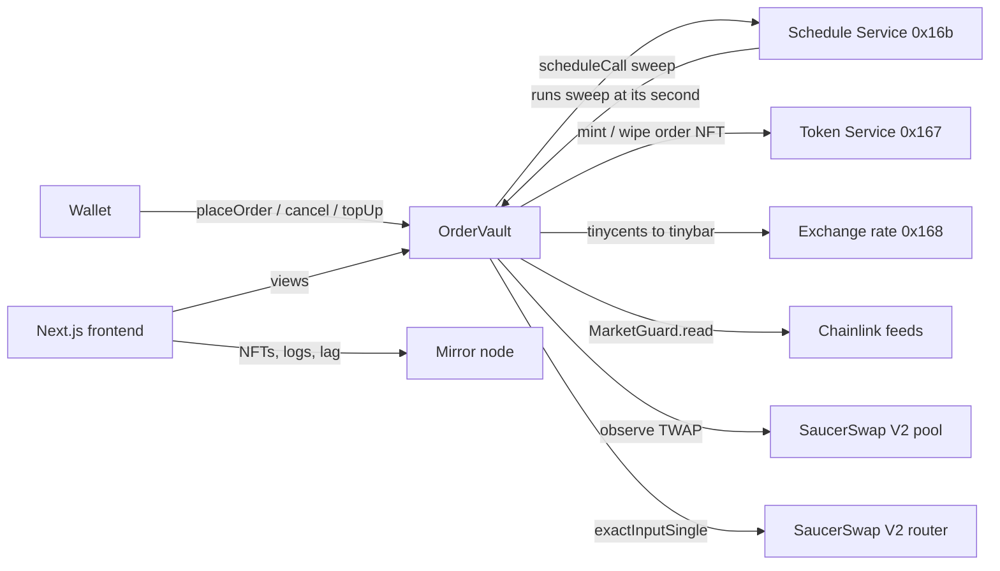
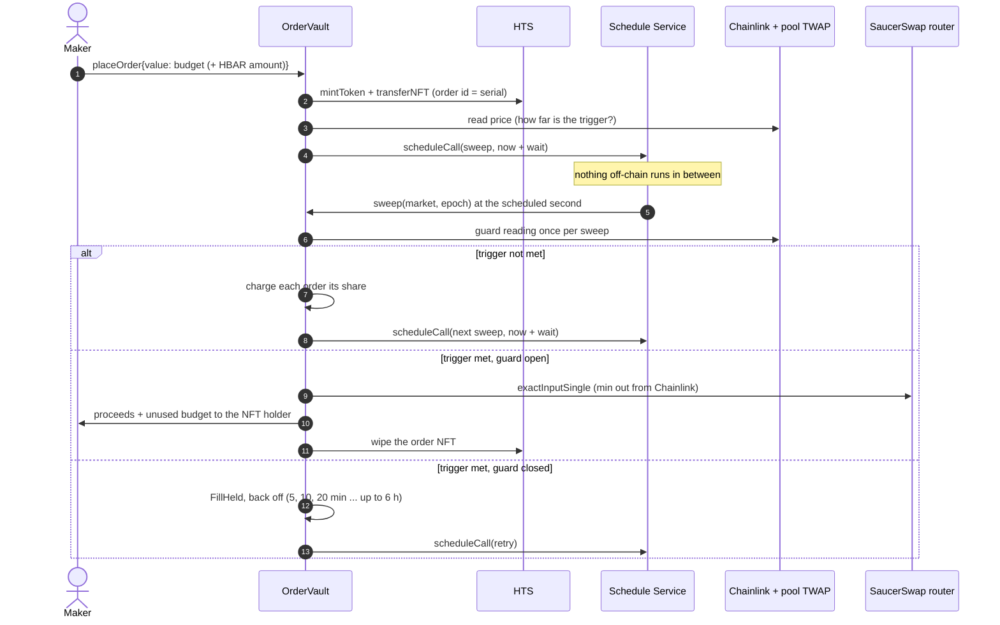

# Architecture

How `OrderVault` works, what each Hedera service does in it, what an order costs, and how it can fail. The [README](../README.md) covers setup and the live proofs.

## Components



| Contract | Role |
|---|---|
| `contracts/OrderVault.sol` | Escrow, order state, per-market sweeps, fills, settlement, credits, cost views. Kept under Hedera's 24 KB limit. |
| `contracts/libraries/MarketGuard.sol` | External library. Reads both Chainlink feeds and the pool TWAP, returns a verdict, and validates guard parameters. |
| `contracts/libraries/OrderCollection.sol` | External library. Creates the order NFT collection once, with the vault as treasury and holder of the supply and wipe keys. |
| `contracts/libraries/PriceMath.sol` | 1.0001^tick in RAY by binary exponentiation (MIT, no GPL TickMath), cross prices, bps helpers. |
| `script/MarketConfig.sol` | Testnet addresses, the two markets, and gas costs measured on testnet. |

## An order from placement to fill



### States

```
placeOrder ──► Open, funded ──sweep: trigger not met ──► pay share, reschedule by distance
                  │   ├─ trigger met, guard closed ──► FillHeld, back off
                  │   ├─ trigger met, guard open ──► swap (try/catch, gas-capped)
                  │   │        ├─ ok ──► Filled (proceeds + unused budget to holder, NFT wiped)
                  │   │        └─ revert ──► FillFailed, back off
                  │   ├─ budget can't pay a check ──► Open, unfunded: "Budget empty" (pays its part of this sweep)
                  │   │        └─ topUp ──► funded again, checks resume
                  │   └─ past expiry ──► Expired (escrow + budget refunded, NFT wiped)
                  └─ cancel by NFT holder ──► Cancelled (escrow + budget refunded, NFT wiped)
```

## When checks run

Scheduling a contract call through HSS is a fixed network fee: `ScheduleCreate` with an inner `ContractCall` is $0.0099 + $0.09, plus Hedera's 20% system-contract surcharge. Measured on testnet in isolation:

| Sweep segment | Gas |
|---|---|
| `HSS.scheduleCall` (same for 2M or 12M gas limits and 300 s to 1 day delays; +212 per KB of calldata) | 1,410,346 |
| Chainlink `latestRoundData`, each | 18,747 |
| Pool `observe` (TWAP) | 22,709 |
| `hasScheduleCapacity` | 5,537 |
| Exchange-rate lookup | 3,122 |
| One sweep's own logic (loop, storage, events), per order | ~10,600 |

So about 89% of a check is the schedule fee, and the only real lever is how many sweeps run. Hedera bills gas used, not the gas limit, so padding the limit changes nothing but the balance the vault must hold up front.

Each sweep therefore waits about as long as the price needs to reach the nearest trigger:

```
wait = distance_to_nearest_trigger_bps × 1 h ÷ maxMoveBpsPerHour, clamped to [minInterval, maxInterval], ≤ time to expiry
```

| Market | minInterval | maxInterval | maxMoveBpsPerHour |
|---|---|---|---|
| HBAR / USDC | 5 min | 6 h | 250 |
| DAI / USDC | 5 min | 6 h | 25 |

- **Triggered orders the guard holds** (and failed swaps) back off: 10, 20, 40 min … up to `maxInterval`.
- **Rotation:** when more orders are open than one sweep checks (`maxOrders`), the next sweep runs at `minInterval`.
- **A new order that needs a check sooner** than the pending sweep schedules an earlier one under a new epoch. The superseded sweep still fires, sees a stale epoch, and returns at once; the new order pays for that empty run.
- **The trade-off:** a move faster than `maxMoveBpsPerHour` is caught late. The fill is still priced from Chainlink at fill time and guarded, and anyone can call `executeOrder` or `sweep` at their own cost to check sooner.

## What it costs

Every figure comes from the vault's views (`checkCost`, `checkCostShared`, `fillCost`, `minBudget`, `nextCheckDelay`), which price gas in USD cents and convert it through `0x168`. At the testnet rate (1 HBAR = 7.7 ¢):

| | HBAR |
|---|---|
| One check, order alone in its market (1,580,000 gas + 10% margin) | 1.8977 |
| One check, shared by 2 / 5 / 20 funded orders | 0.9849 / 0.4372 / 0.1634 |
| Reserve an order always keeps (fill + its part of a final sweep), HBAR sell / token sell | 0.8768 / 1.2371 |
| Minimum budget at placement (reserve + 6 solo checks), HBAR sell / token sell | 12.2633 / 12.6236 |

What a market costs per day, alone, before and after distance-aware scheduling:

| Situation | Before (every 5 min) | After |
|---|---|---|
| HBAR limit 5% away (checked every 2 h) | 546.5 | 22.8 |
| HBAR limit 10% away (every 4 h) | 546.5 | 11.4 |
| Any trigger 15%+ away, or a long guard hold (every 6 h) | 546.5 | 7.6 |
| DAI stop 50 bps away (every 2 h) | 546.5 | 22.8 |
| Trigger within 0.2% on HBAR or 0.02% on DAI (every 5 min) | 546.5 | 546.5 |

The ticket sizes the budget to cover the order's whole lifetime at today's distance, then shows the cost next to each expiry option. Orders sharing a market split the fixed part, so each pays less.

**Nothing comes from the vault's spare HBAR.** Each order's reserve pays for its fill and for its part of the chain's final sweep. When the last funded order leaves while a sweep is pending, it pays for that sweep's empty run. An order that brings a sweep forward pays for the superseded one.

## Why each Hedera service is load-bearing

- **Schedule Service:** without it, nothing happens after placement except by a bot. The vault pays for its own schedules out of order budgets; the payer of every scheduled sweep is the vault.
- **Token Service:** the order *is* the NFT. Whoever holds it cancels and gets paid, so orders are transferable positions. Settlement wipes it with the vault's wipe key and never reverts the sweep. HTS payouts that fail (unassociated receiver) become `claim` credits.
- **Exchange rate:** gas is priced in tinycents and converted at the live rate, so budgets track the HBAR price.
- **Mirror node:** My orders is the wallet's NFTs plus its `OrderPlaced` logs. Each order's trail is its event history, linked to HashScan.

## Threat model

| Threat | Mitigation | Test |
|---|---|---|
| Stale or invalid oracle | Answer ≤ 0 → `OracleInvalid`; older than `maxOracleAge` → `OracleStale`. Either holds the fill | unit, fork |
| Price manipulation | The trigger reads Chainlink, not the pool. Min out comes from Chainlink, so a sandwiched pool reverts the swap (caught). The 30 min TWAP must sit within `maxDeviationBps` of Chainlink | fork: live HBAR/USDC held at 183,277 bps, DAI/USDC open at 23 bps |
| Owner weakens the guard | `MarketGuard.paramsValid`: TWAP 5 min to 1 day, oracle age 60 s to 26 h, deviation and slippage ≤ 10%, slippage above the pool fee | unit |
| Missing TWAP history | Failed `observe` → `TwapUnavailable` → held | unit |
| Reentrancy | `nonReentrant` on every entry point; state written before transfers; HBAR payouts gas-capped; failures credited | unit |
| Scheduling griefing | Budgets prepay checks; unfunded orders are skipped; only the scheduled epoch reschedules; capacity probe with jitter | unit, invariant |
| Vault paying fees | Budgets are charged before rescheduling; `surplus()` is the only withdrawable HBAR | invariant (solvency) |
| Checks stop | `sweepStatus` reports `Stalled`; anyone can `restartSweep`; the UI shows "Checks stopped" with a restart button | unit, e2e |
| Fill runs out of gas | The swap gets `gasleft() − reserve`, so the reschedule always runs; a short sweep rechecks at `minInterval` | unit, invariant (no scheduled sweep reverts) |
| Token association | The vault associates market tokens at listing; the UI checks the mirror node and offers HIP-719 `associate()`; failed payouts are credited | unit, e2e |
| Wallet gas estimates too low | The relay's `eth_estimateGas` undercounts HTS and HSS work (a placement estimated at 551,766 needs up to 2.8M), so every such call sends a measured limit from `utils/orders/gas.ts`; Hedera bills only gas used | e2e asserts the limit; live spec places orders on testnet |
| Decimals (HBAR 8 in the EVM, 18 in wallet `value`; USDC 6; DAI 8; Chainlink 8) | Contracts use tinybar; `units.ts` is the only conversion module | vitest, fuzz |

### Known limits

- **A residual stall is recoverable, not preventable.** A scheduled sweep must pay `gasLimit × gas price` at execution. `surplus()` withholds a payer float (one sweep of the costliest funded market, ~3 HBAR, endowed at deploy by `fund()`), so an owner withdrawing surplus can never starve the keeper. What no on-chain reserve can rule out is a gas-price spike past the cost model's safety margin, or a third party saturating HSS's per-second gas capacity at the second the vault targets: either can stop one market's chain. That is why `restartSweep` is permissionless — the UI shows "Checks stopped" and anyone can resume it once capacity or balance frees. It is a self-healing edge, not a keeper.
- **An NFT sent to the vault** settles into a credit nobody can claim. Sending your order to the vault gives it up.
- **Testnet pools.** The only testnet HBAR/USDC pool trades about 19× above Chainlink, so its guard never opens there (see the README for the numbers and how to re-align a pool).

## Invariants

`test/OrderVault.invariant.t.sol` drives random placements, cancels, top-ups, NFT transfers, price moves, claims, restarts and the passage of time. HSS is simulated faithfully: every accepted schedule, superseded ones included, runs at its second with its own gas limit. After every call:

1. Escrow per token equals open orders' inputs, and total budgets equal open budgets.
2. The vault holds at least what it owes, in every asset.
3. Credit totals match per-account credits.
4. Open lists, funded counters and NFTs agree with order state.
5. A settled order has no NFT.
6. **Liveness:** every funded open order is looked at by a scheduled sweep within its market's longest wait, plus rotation, and no scheduled sweep reverts.
