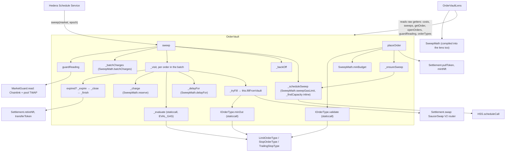

# Pluggable order types — design

Status: **implemented in v1.1.** Limit, stop-loss and trailing stop are order-type plug-ins. Limit and stop
behave exactly as the fixed v1.0.1 logic did, which a differential test checks against the v1.0.1 vault. This
document describes the design as built, the trust model, the trailing stop, and what it cost in gas and size.

## Goals and constraints

- One order type = one small, **stateless strategy**. The vault keeps owning all state and all funds.
- Add a type **after deploy** without redeploying the vault (so a type cannot be a linked library).
- **No new trust in the strategy code**: a buggy or hostile allowlisted type must not be able to move funds,
  corrupt storage, reenter, or force a bad fill past the guard.
- Stay under 24,576 bytes with **≥ 3 KB headroom** after the refactor (v1.0.1: 24,242, 334 B free). Result:
  21,254 bytes, 3,322 B free.
- Keep the cost per check within a few thousand gas of v1.0.1's, and keep distance-aware scheduling working.
  Result: +3.1k gas per check and +5k per sweep, measured below.

## The interface

An order type is an external contract implementing a **view-only** strategy (`contracts/interfaces/IOrderType.sol`).
The vault holds the order; the strategy only reads what the vault passes and returns decisions and the next state.
Every method is `pure` and the vault reaches it by `staticcall`, so a strategy cannot write storage, send value,
or reenter.

```solidity
interface IOrderType {
    /// Placement-time check. Return false (or revert) and the vault rejects the order with InvalidOrderParams.
    function validate(Side side, uint128 amountIn, uint128 param, uint16 slippageBps, uint40 expiry, uint40 nowTs)
        external pure returns (bool ok);

    /// The whole per-check decision in one call, so a check costs one staticcall.
    /// distanceBps: 0 when the trigger is met (fill now); otherwise how far the price is from the trigger, which
    /// the vault turns into the next-check delay. Never 0 for an unmet trigger: use PriceMath.distanceBps.
    /// newState: this order's opaque per-type state (e.g. the trailing peak); the vault stores it when it changes.
    function evaluate(Side side, uint128 param, bytes32 state, uint256 oraclePrice)
        external pure returns (uint256 distanceBps, bytes32 newState);

    /// An optional extra minimum-out floor, priced from Chainlink only. Return 0 to rely on the vault's floor.
    function minOut(Side side, uint128 amountIn, uint128 param, uint256 oraclePrice) external pure returns (uint256);
}
```

The strategy sees only the order's side, amount, its type parameter (`typeParam`) and state (`typeState`), and the
Chainlink cross price the sweep already read. The vault, not the strategy, decides whether the guard is open,
whether there is budget, and whether gas remains. The strategy only answers "is the trigger met, how far away is
it, and what extra slippage floor do I want".

## Dispatch: external contract, not library or delegatecall

Three options were considered:

1. **Linked library**: shares the vault's storage, cheapest call. Rejected: libraries are linked at deploy, so
   a new type could never be added to a live vault, which defeats the point.
2. **Delegatecall to an allowlisted logic contract**: lets a type keep its own per-order storage. Rejected:
   delegatecall runs foreign code in the vault's storage and context, so a bad type could collide storage slots,
   move funds, or reenter. That is exactly the trust we refuse to add.
3. **Staticcall to an allowlisted view contract** (chosen): the type is pure logic over data the vault passes.
   It cannot write, cannot reenter, cannot touch funds. The vault owns every SSTORE. The cost is one `staticcall`
   per check and passing state in and out.

The vault keeps a small registry:

```solidity
mapping(uint8 id => address impl) public orderTypes;
mapping(uint8 id => bool active) public orderTypeActive;
uint8 public orderTypeCount;
function registerOrderType(address impl) external onlyOwner returns (uint8 id);   // append-only
function setOrderTypeActive(uint8 id, bool active) external onlyOwner;             // gate NEW orders only
```

Only the **owner** can register or pause a type, so the allowlist is the trust boundary. Registration is
append-only and an order keeps its type id forever, so a type a live order depends on can be paused for *new*
placements but never swapped out from under an open order. The deploy script registers limit as 0, stop as 1 and
trailing stop as 2, and reverts if the vault hands out other ids.

### Why a hostile allowlisted type still cannot hurt an order

- It is `pure` and reached by `staticcall`: no writes, no value, no reentrancy.
- `distanceBps` is advisory. Even at `distanceBps == 0`, the vault still requires the **guard open** and still
  floors the swap with its own Chainlink-priced minimum (Chainlink value less the maker's slippage). It takes
  `max(vault floor, type minOut)`, so a type can only ask for *more* protection, never less.
- `newState` is opaque bytes the vault stores in that order's own slot and hands back; it can't alias another
  order's storage.
- A type that reverts or runs long is contained: `evaluate` gets a fixed stipend (`EVAL_GAS`, 100,000 gas), and a
  failure skips that order for this check (`OrderEvalSkipped`) and schedules the next sweep soon. It is never a
  fill, and the sweep carries on with the other orders.

Each of these has a test in `test/OrderVault.plugins.t.sol` and `test/OrderVault.audit.t.sol`: an always-fill type
that waives the floor cannot fill below the vault's floor or with the guard closed; a type asking for a tighter
floor gets it, and one asking for an impossible floor holds the order; pausing a type blocks new orders while
existing ones keep working and stay cancellable; reverting and gas-burning types are skipped while the sweep goes on.

## Storage layout

`Order` carries a type id, a type parameter and one opaque state word:

```solidity
struct Order {
    uint32 marketId; Side side; uint8 orderType; Status status; bool funded; uint16 slippageBps;
    uint40 createdAt; uint40 expiry; uint128 amountIn; uint128 typeParam; uint128 budget;
    bytes32 typeState;
}
```

- `orderType` (1 byte) replaces v1.0.1's `Trigger` enum and packs into the existing first slot.
- `typeParam` is v1.0.1's `triggerPrice` field: the trigger price for limit and stop, the trail in bps for
  the trailing stop.
- `typeState` is one new 32-byte slot. It stays zero for limit and stop, which carry no per-check state, so
  those orders never write it. Only trailing orders do.

## Call graph

What runs where, for a scheduled sweep, a placement and a lens read. Everything in the `OrderVault` box is the
vault's own code; the other boxes are separate contracts or libraries.



`SweepMath` is an internal library, so its code is compiled into both the vault and the lens: a lens preview and
the vault's charge come from the same functions. `MarketRegistry` (listing and tuning markets) and
`OrderCollection` (the one-time NFT collection) are external libraries on owner-only paths and are not on any
sweep, placement or fill.

## The three shipped types (behaviour unchanged for the first two)

- **Limit** (`LimitOrderType`): met when, for a sell, `oraclePrice ≥ typeParam`; for a buy, `oraclePrice ≤
  typeParam`. Exactly v1.0.1's `Sell+AtOrAbove` / `Buy+AtOrBelow`. Stateless.
- **Stop** (`StopOrderType`): the mirror. A sell fires at or below, a buy at or above. Exactly v1.0.1's
  stop-loss / stop-buy. Stateless.
- **Trailing stop** (`TrailingStopType`): stateful, below.

Limit and stop keep v1.0.1's trigger maths. `test/OrderVault.differential.t.sol` runs both vaults through the
same random placements, cancels, top-ups, sweeps, price moves and passage of time (256 runs × 100 calls, each vault
in its own transaction) and requires identical balances, escrow, budgets and order state after every action.

One deliberate change from v1.0.1 applies to all three types: `deviationBps` rounds down, so a price a fraction of
a basis point short of its trigger used to read as distance 0 — met — and could fill up to 1 bp early. The types
now use `PriceMath.distanceBps`, which returns at least 1 for an unmet trigger. The trailing-stop fuzz found it.

## Trailing stop semantics

A trailing stop (sell side) rides the price up and fires on a pullback:

- **State:** `typeState` holds the **peak**, the highest Chainlink cross price the order has seen at a check.
- **On each check** (`evaluate`): `peak' = max(peak, oraclePrice)`; the trigger is `peak' × (1 − trail)`.
  `distanceBps` is 0 when `oraclePrice ≤ trigger`, else the distance from `oraclePrice` down to `trigger`. When the
  peak rises, the vault stores it and emits `OrderStateUpdated(orderId, peak)`; otherwise nothing is written.
- **Trail** is `typeParam` in bps (e.g. 200 = 2%), bounded `[MIN_TRAIL_BPS, MAX_TRAIL_BPS]` = 50–5,000 (0.5%–50%)
  at `validate`.
- **Seed:** the peak starts at the price at the first evaluation (placement), so the first trigger is
  `price × (1 − trail)`.
- **Sell side only.** The buy-side mirror (track the trough, fire on a rise) is the same contract with `min` for
  `max`; it is left out of v1.1 to keep the shipped types small and fully tested.

**The limitation, stated plainly.** The peak is the maximum of the oracle **sampled at scheduled checks**, not
the true continuous high. A spike that rises and falls back entirely between two checks is not captured, so the
trail can lock in less than a hypothetical continuous trail would. This is inherent to an on-chain,
pay-per-check design and is stated in the UI and docs. Distance-aware scheduling reduces it — as the price nears
the trigger the checks get closer together — but does not remove it. A manual `executeOrder` fills a met trigger
but does not record a new peak, so only the scheduled sweeps sample it.

**Interaction with distance-aware scheduling.** The scheduler turns `distanceBps` into a wait
(`wait = distanceBps × 3600 / maxMoveBpsPerHour`, clamped). For a trailing stop the distance is measured to the
*moving* trigger, so when the price sits far above the trigger checks are sparse, and as it falls toward the
trigger they tighten, with no new scheduling code.

## Gas: v1.0.1 vs v1.1, measured

`test/GasMeasure.t.sol` runs each scenario on the v1.0.1 vault and on this one from the same snapshot, each
placement and sweep in its own transaction (`forge test --match-contract GasMeasure --isolate -vv`). The mocks
stand in for HTS, HSS and SaucerSwap, so absolute numbers are below testnet's; the difference is EVM work and
carries over.

| Scheduled sweep | v1.0.1 | v1.1 | Difference |
|---|---|---|---|
| Check, 1 order | 306,743 | 314,844 | +8,101 |
| Check, 5 orders | 392,674 | 413,190 | +20,516 |
| Check, 20 orders | 714,884 | 782,073 | +67,189 |
| DAI fill (token in) | 253,164 | 264,227 | +11,063 |
| HBAR fill (HBAR in) | 207,995 | 219,075 | +11,080 |
| DAI fill + reschedule | 451,705 | 468,572 | +16,867 |
| Expiry | 166,909 | 170,876 | +3,967 |
| Empty run (last order left) | 101,902 | 102,470 | +568 |

That fits about **+5,000 gas per sweep and +3,100 per check**: the strategy `staticcall`, and the cold reads of
the order's type id and state slot. A fill adds about 3,000 more (the `minOut` call and the `Settlement`
delegatecalls). A trailing stop's first check stores its peak (+23,800 over a limit check), a check that raises
the peak +6,600, one that doesn't +2,200.

`MarketConfig.costs()` adds these to the testnet calibration, rounded up: `sweepBaseGas` 100,000, `checkGas`
65,000, fills 455,000 / 755,000, `idleSweepGas` 96,000. The fixed ~1.56 HBAR `scheduleCall` fee (≈ $0.12 on
2026-09-29) still dominates a check, so what an order costs moves very little.

## Size: v1.0.1 vs v1.1

| | v1.0.1 | v1.1 |
|---|---|---|
| `OrderVault` runtime | 24,242 B (334 free) | **21,254 B (3,322 free)** |
| `OrderVaultLens` | — | 8,065 B |
| Order types (limit / stop / trailing) | — | 770 / 770 / 924 B |
| External libraries | `MarketGuard` 3,055, `OrderCollection` 1,458 | + `Settlement` 3,601, `MarketRegistry` 3,309 |

The plug-in machinery itself added about 1.5 KB. Getting from there to 3 KB of headroom took four moves, measured
by stubbing functions out one at a time:

1. **Derived views to `OrderVaultLens`, cost maths to `SweepMath`** (−252 B). Small on its own, because the
   vault still needs the same arithmetic for its own charges, but it gives the frontend one previewer that
   cannot drift from the vault.
2. **The fund-handling layer to `Settlement`** (−2.5 KB): the swap, HTS token and NFT operations, ERC-20 moves.
3. **Market listing and tuning to `MarketRegistry`** (−1.9 KB): owner-only, once per market, so no sweep pays
   for the call. This replaced the earlier plan of moving the scheduling core into a library: that code runs on
   every sweep, so a library would have added a cold `delegatecall` to each one.
4. **The capacity probe back inline** (+150 B): in `Settlement` it cost ~3,300 gas per rescheduling sweep.

Optimizer settings were measured too (via-IR on; legacy codegen hits stack-too-deep). Fewer runs shrink the vault
slightly and cost slightly more gas per sweep; 200 runs stays:

| `optimizer_runs` | `OrderVault` | Check, 1 order | Check, 3 orders | DAI fill |
|---|---|---|---|---|
| 1 | 22,782 | 318,786 | 368,080 | 264,944 |
| 50 | 22,854 | 318,724 | 368,012 | 264,673 |
| 200 | 23,041 | 318,286 | 367,424 | 264,369 |
| 1,000 | 24,624 (over the limit) | 317,546 | 366,600 | 263,586 |
| 10,000 | 27,010 (over the limit) | 317,137 | 365,887 | 262,728 |

(The optimizer table was taken before the `MarketRegistry` move and the probe inline, so its absolute sizes are
those of that build; the trade-off between settings is what it shows.)
